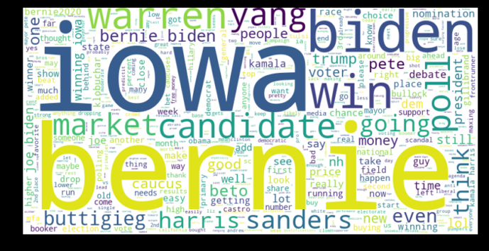

# Webscraping Project
## What is included
The above includes a .py file and corresponding powerpoint presentation. 
## Goals
To scrape Predictit.org of comment information, and using data analysis techniques, see if there are any patterns of interest between the comments and the volume traded and the price of prediction shares. The specific market used was for the 2020 Iowa Democratic Party Caucus results. Prices of candidates reflect the odds the market believes any given candidate is to win the election.
## Techniques Used
Selenium was used for the webscraping portion of this project. Once the information was scraped, Pandas was used to clean the data. For creating graphics, Matplotlib was used.
## Some Results
Below is a word map of most common word that were extracted in the webscraping 

